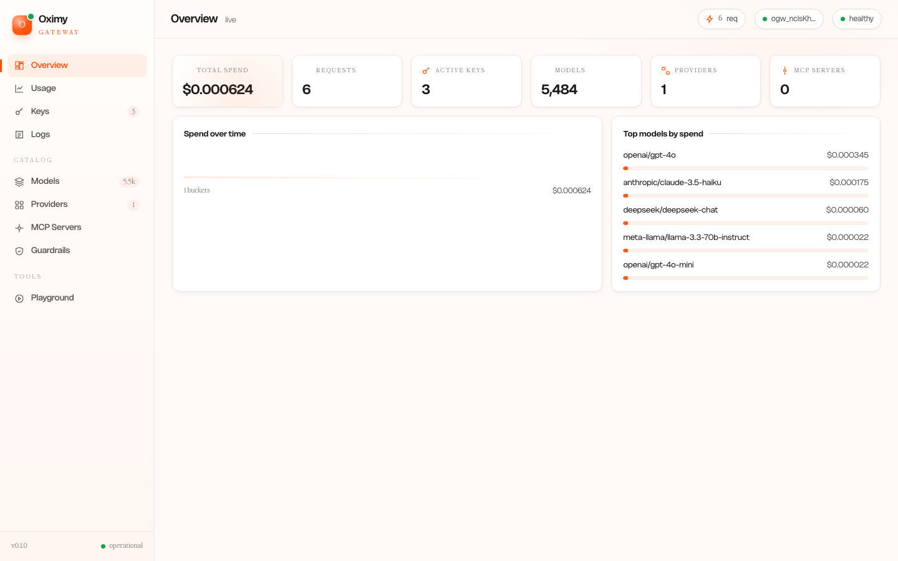
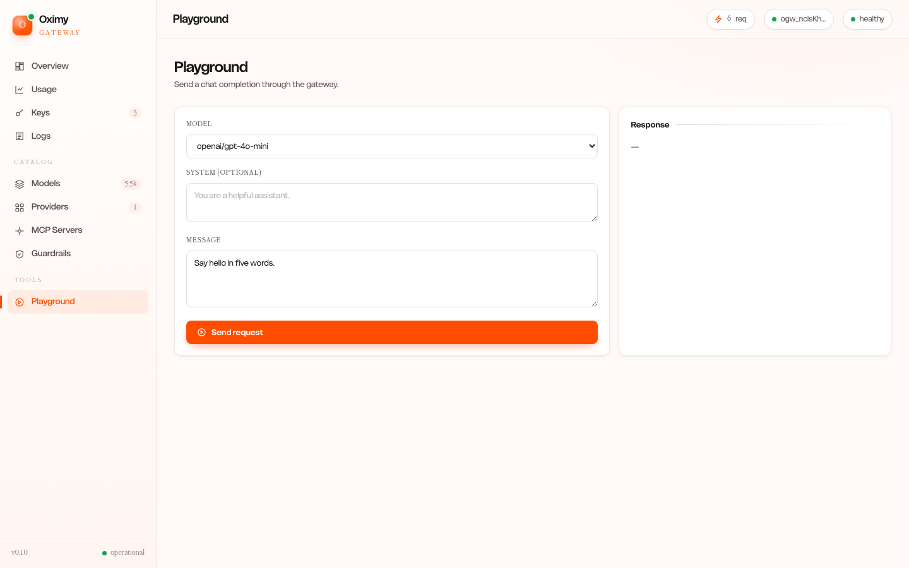
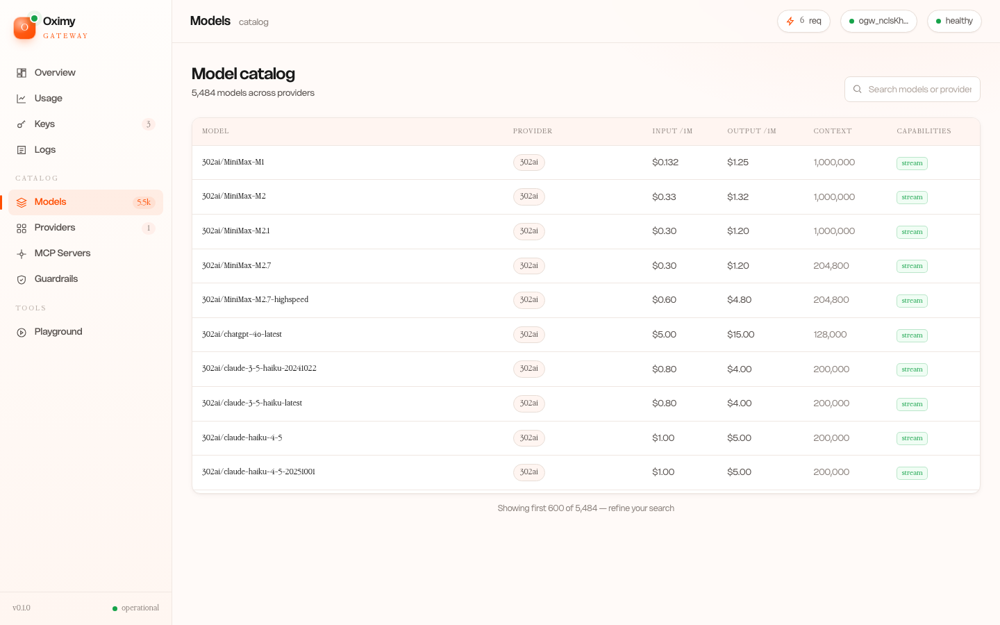
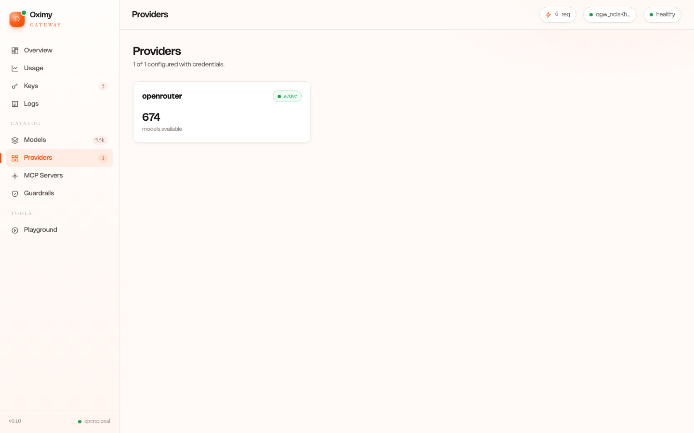
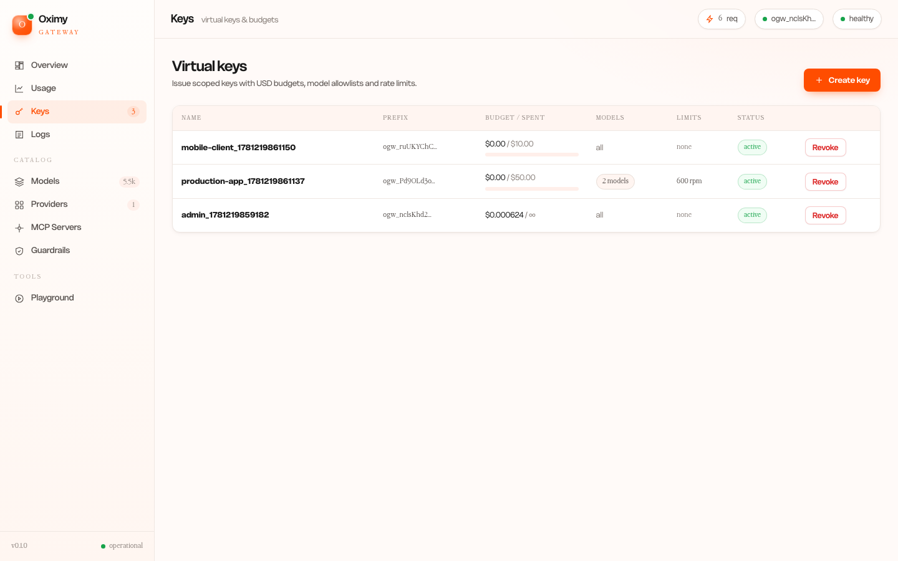
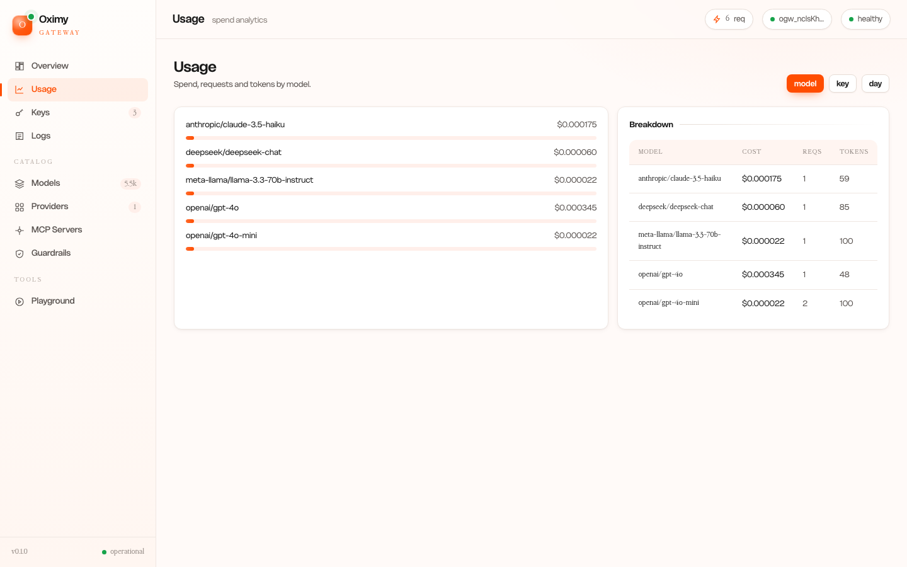
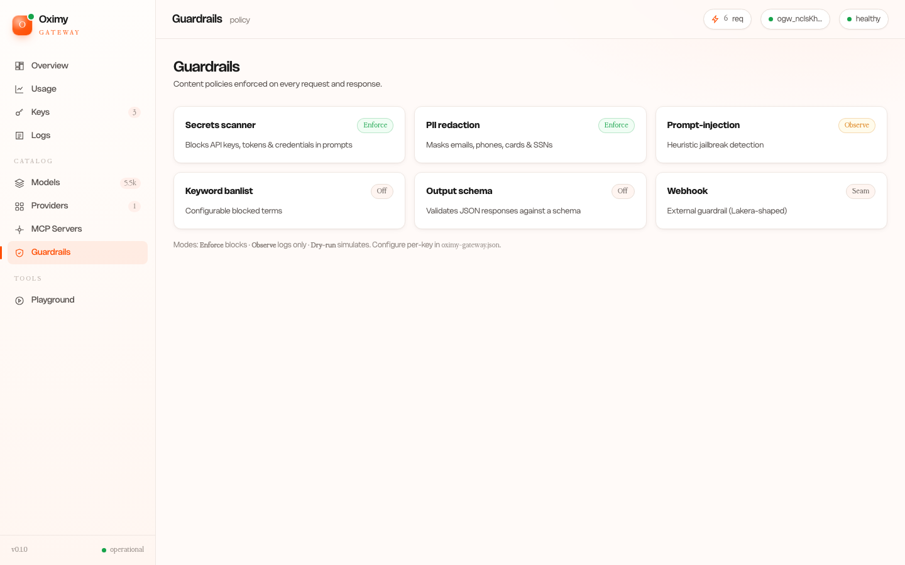
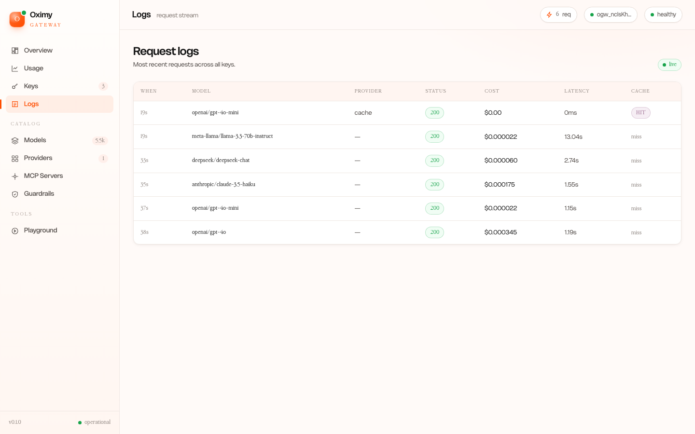

<div align="center">

# Oximy Gateway — Feature Guide

**Every feature, with a dashboard screenshot and a CLI/API example for each.**

</div>

Oximy Gateway is a single Rust binary that routes, governs, observes, and secures
**all** of your AI traffic — both LLM calls (5,484 models across every major
provider) and MCP tool calls — through one shared governance spine. One command
boots it; one bearer key authenticates it; one USD budget covers tokens *and* tools.

```bash
oximy-gateway up        # boots the gateway + dashboard at http://localhost:8080
```

---

## Table of Contents

1. [Quickstart](#1-quickstart)
2. [The Dashboard](#2-the-dashboard)
3. [Unified LLM API](#3-unified-llm-api)
4. [Models & Providers (5,484 models)](#4-models--providers)
5. [Virtual Keys](#5-virtual-keys)
6. [USD Budgets & Durable Spend](#6-usd-budgets--durable-spend)
7. [Rate Limits & Model Allowlists](#7-rate-limits--model-allowlists)
8. [Exact Cost Tracking](#8-exact-cost-tracking)
9. [Response Caching](#9-response-caching)
10. [Guardrails](#10-guardrails)
11. [Routing & Reliability](#11-routing--reliability)
12. [MCP Gateway](#12-mcp-gateway)
13. [Observability](#13-observability)
14. [CLI Reference](#14-cli-reference)
15. [Deployment & Persistence](#15-deployment--persistence)
16. [Admin API Reference](#16-admin-api-reference)

---

## 1. Quickstart

```bash
# Install (any one)
brew install oximyhq/tap/oximy-gateway
curl -fsSL https://raw.githubusercontent.com/OximyHQ/gateway/main/install.sh | sh
cargo install --git https://github.com/OximyHQ/gateway oximy-gateway

# Set at least one provider key, then boot
export OPENROUTER_API_KEY=sk-or-...        # or OPENAI_API_KEY / ANTHROPIC_API_KEY / GEMINI_API_KEY / GROQ_API_KEY / ...
oximy-gateway up
```

On first boot the gateway prints a one-time **admin key** (`ogw_…`), creates a
durable `gateway.db`, and opens the dashboard. Point any OpenAI-compatible SDK at
`http://localhost:8080/v1` with that key.

```python
from openai import OpenAI
client = OpenAI(api_key="ogw_…", base_url="http://localhost:8080/v1")
r = client.chat.completions.create(model="openai/gpt-4o-mini",
    messages=[{"role":"user","content":"Hello!"}])
print(r.choices[0].message.content)
print(r.usage.cost)   # exact USD for this call
```

---

## 2. The Dashboard

A single embedded page (no separate server, no npm) served at `/`, in Oximy's
warm design language. Log in with any virtual key. Nine surfaces:



**Overview** — live spend, request count, active keys, model/provider counts,
spend-over-time, and top models by cost. Updates while you watch.

The dashboard is a thin client of the [Admin API](#16-admin-api-reference) — every
screen has an equivalent CLI/API path, shown per feature below.

---

## 3. Unified LLM API

Point any OpenAI-compatible client at the gateway. It exposes:

| Endpoint | Purpose |
|---|---|
| `POST /v1/chat/completions` | OpenAI Chat Completions (streaming + non-streaming) |
| `POST /v1/responses` | OpenAI Responses API |
| `POST /v1/messages` | Anthropic Messages dialect |
| `GET /v1/models` | Machine-readable catalog with pricing + capabilities |

**curl — a chat completion:**
```bash
curl http://localhost:8080/v1/chat/completions \
  -H "Authorization: Bearer ogw_…" -H "Content-Type: application/json" \
  -d '{"model":"anthropic/claude-3.5-haiku","messages":[{"role":"user","content":"Hi"}]}'
```

**Streaming (SSE):** add `"stream": true` — tokens stream back as `data:` events,
with normalized chunk semantics and usage in the final frame.

**Playground** — try any model from the browser:



The playground sends a real chat through the gateway and shows the reply, the exact
cost, token count, gateway overhead, and which provider served it.

---

## 4. Models & Providers

The gateway ships the **full models.dev catalog — 5,484 models across 142
providers** — with current pricing, context windows, and capabilities (not a fixed
list from a training cutoff). New models are data, available the day they ship.



**Search the catalog (API):**
```bash
curl -s http://localhost:8080/v1/models -H "Authorization: Bearer ogw_…" \
  | jq '.data | length'        # => 5484
```

**Providers** — each provider activates when its env key is set
(`OPENAI_API_KEY`, `ANTHROPIC_API_KEY`, `GEMINI_API_KEY`, `OPENROUTER_API_KEY`,
`GROQ_API_KEY`, `TOGETHER_API_KEY`, `FIREWORKS_API_KEY`, `DEEPSEEK_API_KEY`,
`XAI_API_KEY`, `MISTRAL_API_KEY`, `PERPLEXITY_API_KEY`, `CEREBRAS_API_KEY`, …),
or any OpenAI-compatible endpoint via `OPENAI_BASE_URL`.



---

## 5. Virtual Keys

Issue scoped keys for teammates, apps, or agents — each with its own budget,
model allowlist, and rate limits. The admin key is just the first one.



**CLI:**
```bash
oximy-gateway keys --dir ~/.oximy create --name mobile-app --budget-usd 50 \
    --models openai/gpt-4o,anthropic/claude-3.5-haiku
oximy-gateway keys --dir ~/.oximy list
oximy-gateway keys --dir ~/.oximy revoke key_mobile-app_…
```

**API:**
```bash
curl -X POST http://localhost:8080/v1/admin/keys \
  -H "Authorization: Bearer ogw_admin…" -H "Content-Type: application/json" \
  -d '{"name":"mobile-app","budget_usd":50,"models":["openai/gpt-4o"],"rpm":600}'
# → { "id":"…", "prefix":"ogw_…", "secret":"ogw_…(shown once)" }
```

The dashboard's **Create key** modal does the same; the secret is shown once.

---

## 6. USD Budgets & Durable Spend

Every key can carry a **hard USD budget**. Spend is enforced *before* the upstream
call (fail-closed → `429` when a request would exceed budget), tracked from
real provider-reported usage, and **persisted to the database** — so budgets and
spend **survive restarts**, never reset to zero, and never overspend under
concurrent load.

The robustness model (see
[`docs/2026-06-11-persistence-and-durable-spend-design.md`](2026-06-11-persistence-and-durable-spend-design.md)):
the database is the source of truth, written synchronously with an atomic
reserve→commit→release flow. Correct under concurrency, durable across crashes,
and identical on SQLite (default) and Postgres (HA). A budget bar appears on each
key in the dashboard:

```bash
# A key with a tiny budget rejects with 429 once exhausted — and stays rejected
# after a restart, because spend is durable.
curl -s -o /dev/null -w '%{http_code}\n' http://localhost:8080/v1/chat/completions \
  -H "Authorization: Bearer ogw_budgeted…" -H "Content-Type: application/json" \
  -d '{"model":"openai/gpt-4o","messages":[{"role":"user","content":"hi"}]}'
# → 429 once budget is spent
```

---

## 7. Rate Limits & Model Allowlists

Per key: **RPM** (requests/min), **TPM** (tokens/min), max parallel, and a
**model allowlist** (a key restricted to `openai/gpt-4o` can't call anything else
— `403`). Set them at create time (CLI/API/dashboard) as shown in
[§5](#5-virtual-keys). Over-limit requests return `429` with the breached
dimension; disallowed models return `403`.

---

## 8. Exact Cost Tracking

Every response carries the exact USD cost computed from provider-reported usage,
with integer-precise math (no floating-point drift), cached-token pricing, and
streaming-usage correctness.

- In the body: `usage.cost`
- In headers: `x-overhead-duration-ms` (gateway's own latency), `x-served-by`,
  `x-fallback-fired`, `x-cache`

**Usage analytics** — group spend by model, key, or day:



```bash
curl -s "http://localhost:8080/v1/usage?group_by=model" -H "Authorization: Bearer ogw_…" | jq
# → buckets of { label, cost_usd, requests, tokens }
```

---

## 9. Response Caching

Identical requests are served from an exact-match cache (SHA-256 of model +
endpoint + normalized body, tenant-scoped). A cache **HIT skips the provider call
entirely and costs $0**, with `x-cache: HIT` (+ age) on the response. Only `200`s
are cached; per-request controls (TTL, skip, no-store) via header or body.

```bash
# Second identical request returns instantly with x-cache: HIT and no provider cost
curl -i http://localhost:8080/v1/chat/completions -H "Authorization: Bearer ogw_…" \
  -H "Content-Type: application/json" \
  -d '{"model":"openai/gpt-4o-mini","messages":[{"role":"user","content":"ping"}]}' \
  | grep -i x-cache
```

---

## 10. Guardrails

Content policies run on every request (and response), enforced on the shared spine.
Built-ins: **secrets scanner** (blocks API keys/tokens/credentials in prompts),
**PII redaction** (emails, phones, cards, SSNs), prompt-injection heuristics,
keyword banlist, regex denylist, and JSON-schema validation. Each runs in
**Enforce**, **Observe-only**, or **Dry-run** mode.



```bash
# A prompt containing a secret is blocked BEFORE it reaches any provider
curl -s -o /dev/null -w '%{http_code}\n' http://localhost:8080/v1/chat/completions \
  -H "Authorization: Bearer ogw_…" -H "Content-Type: application/json" \
  -d '{"model":"openai/gpt-4o-mini","messages":[{"role":"user","content":"my key is sk-ant-api03-XXXX"}]}'
# → 403  (blocked by guardrail: detected API key in content)
```

---

## 11. Routing & Reliability

Model dispatch goes through a routing engine supporting **failover chains**
(retry the next provider on a retryable error), **weighted** and **latency-aware**
load balancing, retries with backoff, per-target **circuit-breaker cooldown**, and
**LLM-aware hedging** (fire a backup at ~p95 and take the first to finish). The
served target and whether a fallback fired are surfaced as `x-served-by` /
`x-fallback-fired` headers. Configure routes per model via `OXIMY_ROUTES` or the
config file.

---

## 12. MCP Gateway

The other half of "unified": an authenticated **Model Context Protocol** endpoint
at `POST /mcp` (JSON-RPC 2.0). It federates N upstream MCP servers behind one
endpoint, namespaces their tools (`server__tool`), enforces **per-key tool
allowlists**, audits every tool call on the same spine audit stream, and flags
silent tool-definition changes (rug-pull detection).


```bash
# List the federated tools (ACL-filtered for your key)
curl -s -X POST http://localhost:8080/mcp -H "Authorization: Bearer ogw_…" \
  -H "Content-Type: application/json" \
  -d '{"jsonrpc":"2.0","id":1,"method":"tools/list","params":{}}'
```

Register upstream servers via `OXIMY_MCP_SERVERS` or the config file.

---

## 13. Observability

- **`GET /metrics`** — authenticated Prometheus/OpenMetrics (`gateway_requests_total`,
  `gateway_cost_micros_total`, latency histograms).
- **Request logs** — every request recorded off the hot path (key, model, provider,
  status, cost, latency, cache status), visible live in the dashboard:



- **Response headers** — `x-overhead-duration-ms`, `x-served-by`, `x-fallback-fired`,
  `x-cache`, plus `usage.cost` in the body.
- **`GET /health`** — unauthenticated liveness.

```bash
curl -s http://localhost:8080/metrics -H "Authorization: Bearer ogw_…" | grep gateway_
curl -s "http://localhost:8080/v1/admin/logs?limit=20" -H "Authorization: Bearer ogw_…" | jq '.logs[0]'
```

---

## 14. CLI Reference

```text
oximy-gateway up [--port 8080] [--host 127.0.0.1] [--dir <data-dir>] [--no-open]
oximy-gateway keys [--dir <data-dir>] create [--name N] [--budget-usd X] [--models a,b] [--rpm N] [--tpm N]
oximy-gateway keys [--dir <data-dir>] list
oximy-gateway keys [--dir <data-dir>] revoke <id>
oximy-gateway version
```

Data dir default: `~/.local/share/oximy-gateway` (Linux) /
`~/Library/Application Support/com.oximy.oximy-gateway` (macOS), or `$OXIMY_GATEWAY_DIR`.

---

## 15. Deployment & Persistence

- **Single binary, zero setup:** `oximy-gateway up` writes a durable SQLite
  `gateway.db` in the data dir. Keys, budgets, and spend all persist.
- **Docker:** `docker run -p 8080:8080 -e OPENROUTER_API_KEY=… -v ~/gw-data:/data ghcr.io/oximyhq/gateway:latest`
- **High availability:** set `DATABASE_URL=postgres://…` to move the control plane +
  spend ledger to Postgres — the same atomic SQL is correct across multiple
  replicas, no extra setup. Optional `REDIS_URL` (distributed rate-limit) and a
  ClickHouse export adapter for analytics at scale.
- **Backups:** SQLite is one file; Postgres via standard tooling.

---

## 16. Admin API Reference

All require `Authorization: Bearer <key>`.

| Method & path | Returns |
|---|---|
| `GET /v1/admin/overview` | spend, requests, key/model/provider counts, top models |
| `GET /v1/admin/keys` | all keys with budget, spent, allowlist, limits, status |
| `POST /v1/admin/keys` | mint a key (secret shown once) |
| `POST /v1/admin/keys/{id}/revoke` | revoke a key (effective immediately) |
| `GET /v1/usage?group_by=model\|key\|day` | spend/requests/tokens buckets |
| `GET /v1/admin/logs?limit=N` | recent request log rows |
| `GET /v1/admin/providers` | configured providers + model counts |
| `GET /v1/admin/mcp` | federated MCP servers + tools |

---

<div align="center">

Apache-2.0 · [github.com/OximyHQ/gateway](https://github.com/OximyHQ/gateway) ·
[Architecture](2026-06-10-oximy-gateway-design.md)

</div>
